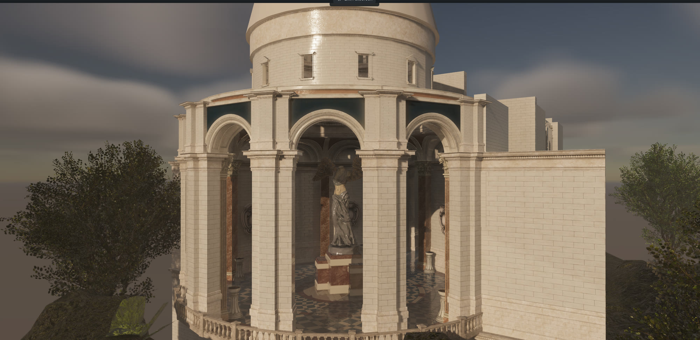
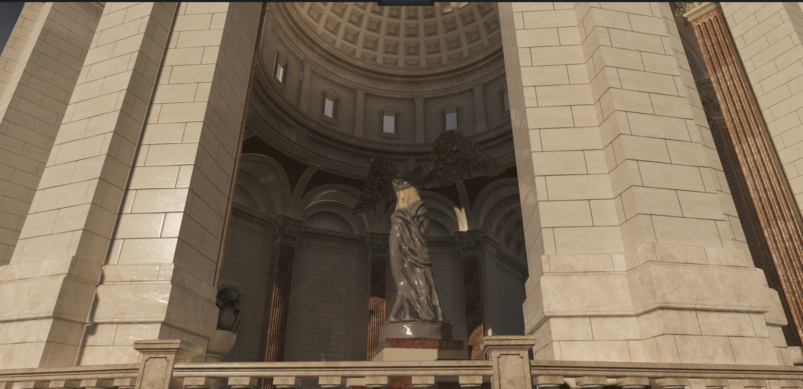
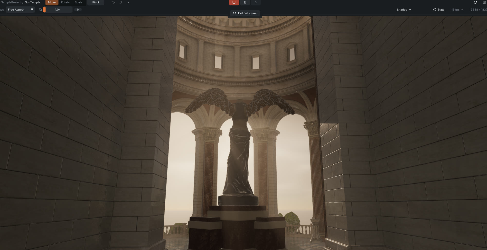
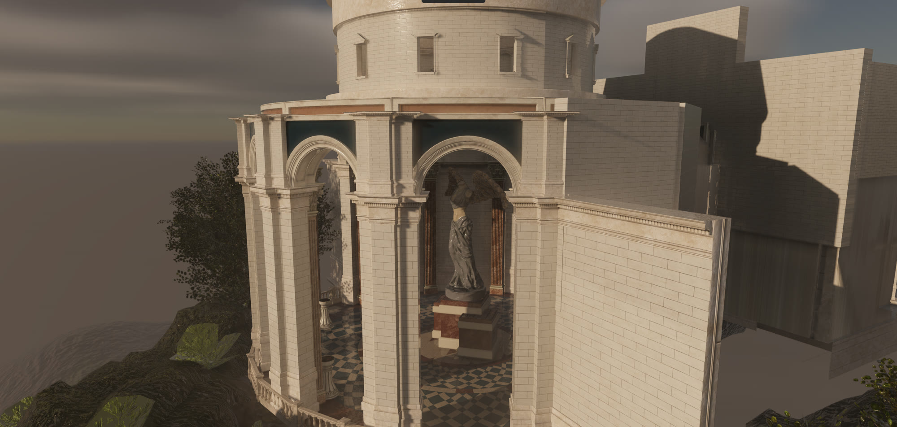
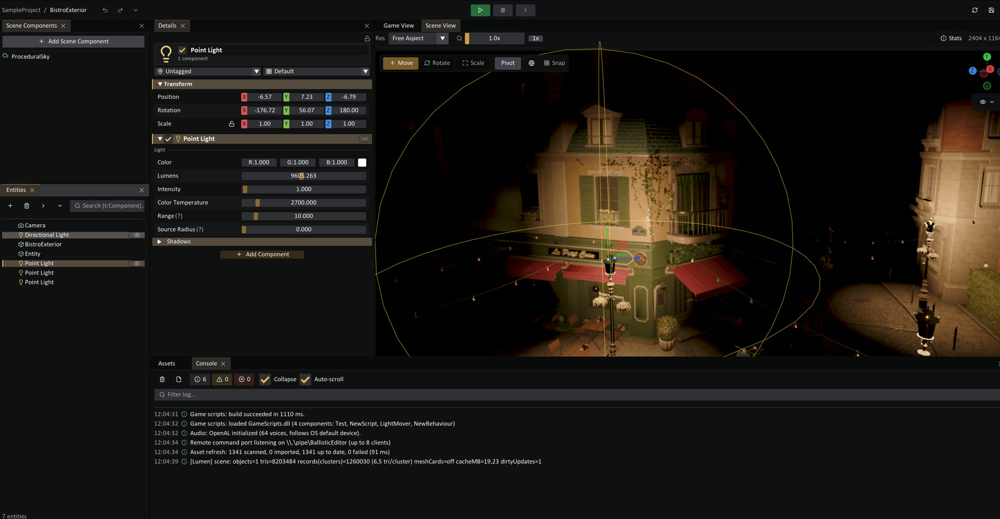

# Ballistic Engine

**A from-scratch C# / .NET 9 game engine with a DirectX 12 + hardware ray tracing renderer, a full ImGui editor, and a headless, AI-operable agent surface.**


Ballistic Engine is a solo project exploring how far a modern, real-time engine can be pushed in pure C#: a real-time-ray-traced global illumination pipeline, a GPU-driven renderer, a Unity-style editor and asset pipeline, C# hot-reload scripting, a physics system, and a server-authoritative networking stack — all written from the ground up. Its idioms deliberately mirror Unity (Entity/Behaviour, `AssetDatabase`, `.meta` files, an edit/play split) so the workflow feels familiar.

> **Not a Unity project** despite what the folder name might suggest — it's a standalone engine.

---

## 🖼️ Gallery

All shots below are **live frames** straight from the editor / runtime — hardware ray-traced global illumination, no offline bake.

### Sun Temple



<p align="center">
  
  
</p>



### The editor



<sub>Sun Temple and Bistro are open test scenes from the NVIDIA ORCA library.</sub>

---

## ✨ Highlights

### Rendering — DX12 + DXR
- **Hardware ray-traced global illumination** ("Lumen"-style): per-pixel screen traces fall back to an inline `RayQuery` over the scene TLAS, sampling a **per-triangle surface-cache radiance cache** filled by a compute pass with direct lighting, multi-bounce radiosity, and emissive-triangle area-light NEE. Screen-probe gather + a sparse world-space radiance clipmap for the far field.
- **GPU-driven pipeline** — whole-mesh geometry is drawn via `ExecuteIndirect` after a GPU compute frustum cull, Hi-Z occlusion cull, and a bindless material table (CPU submit was the bottleneck on Bistro-scale scenes).
- Cascaded shadow maps (texel-snap cached), **GTAO**, **SSR + ray-traced reflections** (reflections re-sample the same GI radiance cache), volumetric fog, **TAA**, bloom, and automatic exposure.
- **Upscaling & denoise** via vendored native SDKs — AMD **FSR**, Intel **XeSS**, NVIDIA **DLSS**, and Intel **OIDN** for denoising.
- A z-prepass–invariant frame with a transient render-target pool and per-pass GPU timers.

### Editor
- **ImGui-based editor** with a scene viewport, transform gizmos, and collider drag-handles.
- **Attribute-driven inspector** — one drawer pipeline shared by components and post-processing volume parameters (`[Header]`, `[Range]`, `[ShowIf]`, `[FoldoutGroup]`, …); a new value type is one drawer registration, no hand-rolled widgets.
- Hierarchy, asset browser (drag-and-drop), whole-scene YAML undo, and an in-editor realtime profiler.
- **Unity-style post-processing volume framework** (`Volume` → `VolumeProfile` → `VolumeComponent`s, blended per frame).

### Assets
- **Unity-style asset pipeline** — `AssetDatabase`, `.meta` GUID sidecars, and a `Library/` artifact cache. Import via AssimpNet / StbImageSharp / Magick.NET, with a `ModelImporter` that auto-binds PBR textures by filename convention, converts FBX units, and can import **Unity `.unitypackage`** scenes/prefabs.
- Scenes are human-readable YAML; components are reflected automatically (public fields *and* properties), asset references serialize as GUIDs.

### C# scripting
Game code is **plain C#** — any `.cs` file under the project, exactly like Unity. No engine rebuild, no special project setup.

- **Live hot reload.** Scripts compile to a **collectible `AssemblyLoadContext`** and reload on window-focus regain or `Ctrl+R`. Compile-*first*: on an error nothing changes and the message lands in the console as `Assets/…​.cs(line,col): error CSxxxx`; on success the live scene round-trips through YAML onto the new types.
- **Reload during play** — unlike Unity, a reload does **not** stop play. Play-mode spawns and mutated values survive; lifecycle restarts on the new types. The pre-play snapshot is untouched, so *Stop* still returns to the edit scene.
- **Sandboxed** — a script exception never crashes the engine (`ScriptGuard` catches every lifecycle dispatch, logs a portable-PDB stack, and auto-disables a callback that throws 3× in a row).
- **Zero wiring** — a new `Behaviour` shows up in the Add-Component menu and deserializes from scenes automatically; drag a `.cs` tile onto an entity to attach it. An engine-managed `Scripts.csproj` at the project root lets any IDE open game code as a real project.

### Networking & gameplay
A from-scratch, **server-authoritative** multiplayer stack modeled on Photon Fusion / Unreal — not a wrapper around an existing library.

- **Topologies:** offline / client / server / **host** (listen-server), all behind one `NetworkManager`.
- **Ownership & authority** — `NetworkObject` carries state/input authority; `NetworkBehaviour` exposes `IsOwner` / `HasStateAuthority` / autonomous-vs-simulated-proxy and lifecycle hooks (`OnSpawned`, `OnStartServer/Client/LocalPlayer`, `NetworkTick`, `OnOwnershipChanged`, interest gained/lost).
- **Replication via source generator** — mark a field `[Networked]` or a method `[Rpc]` and a **Roslyn generator** emits the changemask delta (de)serialization at compile time (bit-packed through `BitReader`/`BitWriter`; up to 32 networked fields per behaviour, enforced with a diagnostic).
- **Client prediction + server reconciliation** — sequenced `NetworkInput` with a server inbox and last-processed-seq, plus reconnect tokens with a TTL.
- **Pluggable transport** (`ITransport`): **LiteNetLib** UDP, an in-process **Loopback** (single-process host), and a **Simulated** transport that injects latency/loss for testing.
- **Gameplay framework** — Unreal-style `Pawn` / `PlayerController` (possession model) / `PlayerState` / `GameState` on top of the netcode.

### Physics
- **BepuPhysics 2** behind an `IPhysicsWorld` abstraction — rigidbodies, box/sphere/capsule/mesh colliders (with auto-fit), triggers, continuous collision, and `OnCollision*` / `OnTrigger*` contact events on behaviours.

### 🤖 Agent surface (AI-operable)
The engine is fully operable **headlessly**, with a CLI (`bal`) and an MCP server that let a coding agent (or a script) drive it without a window — every verb prints JSON with honest exit codes:

- `bal map / schema / scene` — orient in a project and do typed scene CRUD (never guess component members).
- `bal simulate` — the **real engine headless** (scripts + physics play, no rendering); deterministic scripted input, numeric time series.
- `bal render` + `bal imgdiff` — deterministic, diffable captures and perceptual image diffs.
- `bal query` — **spatial perception** via inline DXR `RayQuery` over the scene TLAS (occupancy / classify / rooms / visibility) so the agent asks the 3D world instead of guessing from pixels.
- `bal gbuffer / perf / validate / describe` — raw G-buffer dumps, perf stats, and scene checks.

---

## 🧱 Tech stack

- **Language / runtime:** C# 13 on .NET 9
- **Graphics:** DirectX 12 + DXR via [Vortice.Windows](https://github.com/amerkoleci/Vortice.Windows) (hardware ray tracing required for GI)
- **Math & audio:** OpenTK (`OpenTK.Mathematics` + OpenAL bindings)
- **Physics:** BepuPhysics 2
- **Networking:** LiteNetLib (UDP transport) + a compile-time replication source generator
- **Asset import:** AssimpNet, StbImageSharp, Magick.NET
- **Serialization:** YamlDotNet (scenes) + System.Text.Json
- **Editor UI:** ImGui.NET on a DX12 backend
- **Profiling:** Tracy 0.11.1 (opt-in)

---

## 🚀 Build & run

Requires the **.NET 9 SDK** and a **Windows PC with a ray-tracing-capable GPU** (DX12 + DXR).

```bash
dotnet build BallisticEngine.slnx

# Standalone player
dotnet run --project BallisticEngine.Runtime [projectPath]

# ImGui editor
dotnet run --project BallisticEngine.Editor  [projectPath]

# Headless agent CLI
dotnet run --project BallisticEngine.Cli -- --help
```

`projectPath` defaults to `SampleProject/`. Some large sample scenes reference external test content that is not committed (kept out of git pending a git-lfs decision) — the lighter scenes (e.g. Cornell Box) run out of the box.

---

## 🏗️ Architecture

The engine is **one library** (`BallisticEngine.csproj`) plus thin executables. The design rule is a **strict, one-directional dependency layering that is auditable by `grep`** — each layer may reference only the ones below it, and every third-party dependency is quarantined to a single folder so it can never leak into engine logic:

| Layer / project | May depend on | Never touches |
|---|---|---|
| `Shared/`, `ToolKit/` | BCL only | everything else |
| `Abstraction/` | `Shared` + math | GPU calls, file formats |
| `Engine/` | `Abstraction`, `Shared` | Assimp/Stb/Magick, backend, asset I/O |
| `BallisticEngine.DX12/` | `Engine` types, Vortice/DX12 | asset-import libraries |
| `Physics/` | `Abstraction`, BepuPhysics | Engine internals |
| `AssetPipeline/` | everything + Assimp/Stb/Magick | direct GPU upload |

So the renderer and the physics engine are **injected implementations of abstractions** (`IPhysicsWorld`, the render backend), not hard references — the DX12 backend was swapped in for a deleted OpenGL one without touching `Engine/`. `AssetPipeline/` is the *only* place allowed to touch Assimp/Stb/Magick; `Physics/` the *only* place allowed to touch BepuPhysics; one file owns the job scheduler. Core patterns mirror Unity: **Entity / Behaviour** components, an edit/play split, `SceneBehaviour`s for scene-wide systems, and reflection-driven serialization + inspector.

**Executables** are thin shells over that library:

| Project | Role |
|---|---|
| `BallisticEngine.Runtime/` | Standalone player |
| `BallisticEngine.Editor/` | ImGui editor |
| `BallisticEngine.Cli/` | `bal` — the headless agent CLI |
| `BallisticEngine.Mcp/` | MCP server bridging to the editor |
| `BallisticEngine.SourceGen/` | Roslyn generator for `[Networked]`/`[Rpc]` replication |

---

## ⚠️ Status

An actively developed solo project and a learning/experimentation ground for graphics programming and engine architecture. Windows-only. APIs move fast and there are no stability guarantees — expect rough edges.

## 📄 License

Released under the [MIT License](LICENSE).

Bundled native SDKs (FSR, XeSS, DLSS, OIDN) are the property of their respective vendors and are covered by their own licenses.
